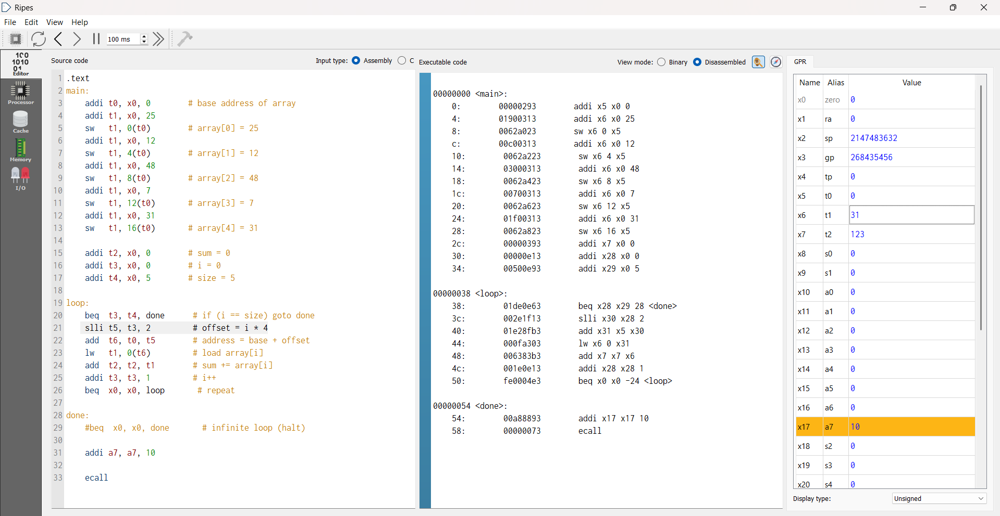

# RISC-V Single-Cycle Processor

A single-cycle RISC-V (RV32I subset) processor implemented in SystemVerilog, built and simulated in Vivado, and cross-verified against [Ripes](https://github.com/mortbopet/Ripes).

This is an ongoing project — currently supports a working subset of RV32I, with full instruction coverage and a move to a pipelined design planned next.

## Supported Instructions

| Instruction | Type | Format |
|---|---|---|
| add, sub, and, or, slt, sll | R-type | funct7 \| rs2 \| rs1 \| funct3 \| rd \| opcode |
| addi, andi, ori, slti, slli | I-type | imm[11:0] \| rs1 \| funct3 \| rd \| opcode |
| lw | I-type (load) | imm[11:0] \| rs1 \| funct3 \| rd \| opcode |
| sw | S-type | imm[11:5] \| rs2 \| rs1 \| funct3 \| imm[4:0] \| opcode |
| beq | B-type | imm[12,10:5] \| rs2 \| rs1 \| funct3 \| imm[4:1,11] \| opcode |

## Repo Structure
├── source_files/          # Processor modules — datapath, control unit, ALU, register file, PC, etc.
├── test_benches/           # SystemVerilog testbenches for individual units and the full wrapper
├── assembly_test_code.s        # Sample RISC-V assembly program used for verification
└── ripes_verification.png  # Verification screenshot

## Verification

The processor was tested by writing a RISC-V assembly test program (`assembly_test_code.s`), assembling and running it in 
[Ripes](https://github.com/mortbopet/Ripes) to get expected register values, then running the equivalent instructions 
through the Verilog testbench in Vivado and confirming matching results.

## What's Next

- Extend instruction coverage to the full RV32I base ISA
- Move from single-cycle to a pipelined design — hazard detection, forwarding, and branch handling

## Tools Used

- SystemVerilog
- Xilinx Vivado (simulation)
- [Ripes](https://github.com/mortbopet/Ripes) (reference verification)  
